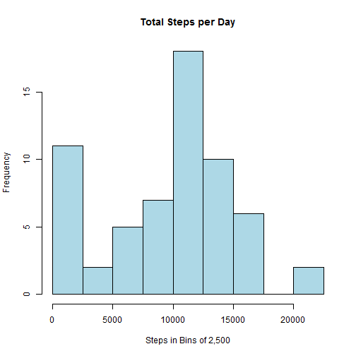
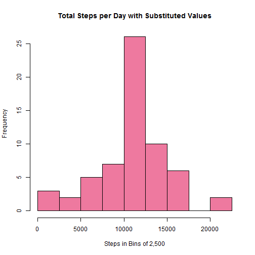
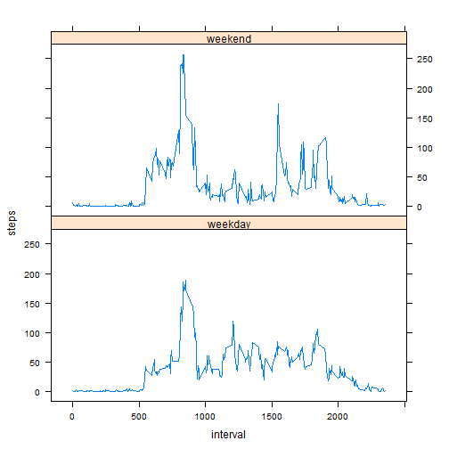

## Loading and preprocessing the data

Reading the dataset is straight forward, assuming the file is in the current working directory. No initial tranforming is necessary.


```r
activity <- read.csv("./activity.csv")
```

## What is mean total number of steps taken per day?

The xtabs funciton can easily produce the total number of steps each day.


```r
xt = xtabs(steps~date,data=activity)
head(xt)
```

```
## date
## 2012-10-01 2012-10-02 2012-10-03 2012-10-04 2012-10-05 2012-10-06 
##          0        126      11352      12116      13294      15420
```
Below is a histogram of the total number of steps, with the mean and median reported below.


```r
hist(xt,breaks = c(seq(0,22500,2500)),col="light blue",xlab = "Steps in Bins of 2,500",main = "Total Steps per Day")
```

 

```r
centers = c(mean(xt),median(xt))
names(centers) = c("Mean","Median")
centers
```

```
##     Mean   Median 
##  9354.23 10395.00
```
## What is the average daily activity pattern?

Time series plot:

```r
plot(mt,type="l",ylab = "Average Steps",main = "Average Number of Steps by Interval")
```

```
## Error in plot(mt, type = "l", ylab = "Average Steps", main = "Average Number of Steps by Interval"): object 'mt' not found
```

```r
steps.interval = xtabs(steps~interval,data=activity)
```

The interval with the most average steps:

```r
which.max(steps.interval)
```

```
## 835 
## 104
```

```r
steps.interval[which.max(steps.interval)]
```

```
##   835 
## 10927
```


## Imputing missing values
First, the number of values that are NA.


```r
sum(is.na(activity$steps))
```

```
## [1] 2304
```
For inputing the missing values, I used the mean of each time interval, rounded to the nearest integer. the code below calculates the mean of steps by interval, mainly with the aggregate function. A new data set is created using the merge function. This adds a column where the proper mean is recorded for the given interval. Lastly, that column is rounded.


```r
mean.steps = xtabs(steps~interval,aggregate(steps~interval,activity,mean))
activity2 = merge(activity,mean.steps,by = "interval")
activity2[,4] = round(activity2[,4])
```
The following line finds the NA values, and replaces that value with the proper rounded mean value.

```r
activity2$steps[which(is.na(activity2$steps))] = activity2$Freq[which(is.na(activity2$steps))]
```

Here, the code finds the total number of steps by date for the new sata set, and the proper measures of center are calculated.


```r
xt2 = xtabs(steps~date,data=activity2)
hist(xt2,breaks = c(seq(0,22500,2500)),col="palevioletred2",xlab = "Steps in Bins of 2,500",main = "Total Steps per Day with Substituted Values")
```

 

```r
centers2 = c(mean(xt2),median(xt2))
names(centers2) = c("Mean","Median")
centers2
```

```
##     Mean   Median 
## 10765.64 10762.00
```

## Are there differences in activity patterns between weekdays and weekends?

To answer this question, first use the weekday function to find the correct day for the given date. Next, change the day to it's proper class (of weekday or weekend).


```r
library(lattice)
activity2$day = weekdays(as.Date(activity2$date))
days.set = unique(activity2$day)
week.days = days.set[1:5]
week.ends = days.set[6:7]
activity2$day[activity2$day %in% week.days] = "weekday"
activity2$day[activity2$day %in% week.ends] = "weekend"
```
Make the day class as a factor, use lattice to plot each. We see that the weekend has higher overall steps in each interval, while the weekday has the highest spike. 


```r
avg.steps = aggregate(steps~interval+day,activity2,mean)
avg.steps$day = as.factor(avg.steps$day)
xyplot(steps ~ interval | day, data = avg.steps, layout = c(1, 2),type = "l")
```

 
